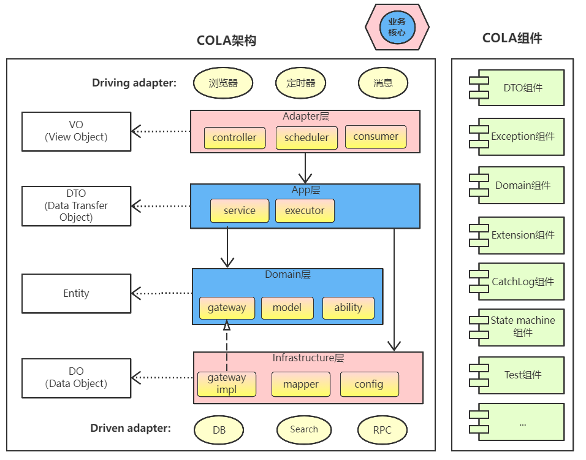

# 轻量级DDD后端脚手架-myddd

参考 [COLA](https://github.com/alibaba/COLA)

架构根据DDD风格设计,每个pkg的作用已经在pkg-info文件中指出,结构包含：

| 模块名 | 子模块 | 职能 |
| :-----| ----: | :----: |
| myddd-components | - |  组件层(可选) |
| myddd-components | myddd-components-bom | 组件聚合包 |
| myddd-components | myddd-components-common | 公共工具包 |
| myddd-components | myddd-components-extension | 扩展(定义接口外部系统实现)| 
| myddd-samples | - | 实现层| 
| myddd-samples | points-contract | API接口契约层| 
| myddd-samples | points-api | 接口API层实现| 
| myddd-samples | points-application | 领域聚合层| 
| myddd-samples | points-domain | 领域层| 
| myddd-samples | points-infrastructure | 基础设施层| 

